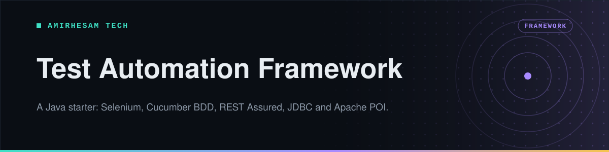

<p align="center">
  
</p>

<p align="center">
  
  
  
  
  
  
  <a href="https://github.com/amirh3sam/MyFrameWorkTemp/stargazers"></a>
</p>

<p align="center">
  <a href="#quick-start"><b>Quick start</b></a> ·
  <a href="#what-is-inside">What is inside</a> ·
  <a href="#running-the-tests">Running tests</a> ·
  <a href="#the-utility-classes">Utilities</a> ·
  <a href="#faq">FAQ</a>
</p>

Starting a new test automation project means making the same ten decisions again: where the driver lives, how configuration is read, how to clean up after a failed test, how to talk to the database, how to open a spreadsheet.

This repository is those decisions already made, with a worked example for each one. Clone it, point it at your own application, and start writing scenarios on day one instead of day four.

- **UI, API and database testing in one project**, so a single scenario can click through a page, confirm it over the API, and check the row that was written.
- **Eleven user stories** that each demonstrate one capability, from a menu bar test to a headless run.
- **The utility layer you would otherwise rewrite**: driver management, configuration reading, waits, spreadsheets and API helpers.

## Quick start

You need **Java 11 or newer**, **Maven**, and Chrome or Firefox installed.

```bash
git clone https://github.com/amirh3sam/MyFrameWorkTemp.git
cd MyFrameWorkTemp
mvn clean install -DskipTests
```

Open [`src/test/java/com/FrameWork/runner/CukesRunner.java`](src/test/java/com/FrameWork/runner/CukesRunner.java), set `tags` to the story you want, and run it:

```java
tags = "@US01"
```

The report lands in `target/cucumber-report.html`.

> [!TIP]
> Selenium 4.18 finds and downloads the browser driver by itself. There is no `chromedriver` to install and no path to configure.

## What is inside

```
src/test/
├── java/com/FrameWork/
│   ├── pages/      page objects: the locators for each screen
│   ├── steps/      step definitions: one class per user story
│   ├── runner/     CukesRunner and FailedTestRunner
│   ├── utility/    Driver, BrowserUtil, ConfigurationReader, DB_Util, API_Util
│   └── javaFiles/  plain Java exercises, kept separate from the framework
└── resources/features/   the .feature files
```

Configuration lives in [`config.properties`](config.properties) at the project root: browser choice, the environments under test, and the connection details for the database examples.

### The eleven user stories

| Story | What it demonstrates |
|---|---|
| `US01` | A UI test against a menu bar, the plain Selenium starting point |
| `US02` | An API test with REST Assured against the Star Wars API |
| `US03` | A database test over JDBC against an HR schema |
| `US04` | API response validation, Game of Thrones data |
| `US05` | Reading and validating data from the Pokemon API |
| `US06` | Authenticating with a token before the real call |
| `US07` | Reading test data out of Excel with Apache POI |
| `US08` | Writing results back into Excel |
| `US09` | Taking a value from an environment variable instead of a file |
| `US10` | The same suite running headless, the way CI runs it |
| `U11`  | Reading and setting browser cookies |

## Running the tests

<details open>
<summary><b>From your IDE</b></summary>

Set the `tags` value in `CukesRunner` and run the class. Use `@US01` for one story, or an expression such as `"@US01 or @US02"` for several.

</details>

<details>
<summary><b>From the command line</b></summary>

```bash
mvn test -Dcucumber.filter.tags="@US01"
```

</details>

<details>
<summary><b>Re-running only what failed</b></summary>

Every run writes the failures to `target/rerun.txt`. [`FailedTestRunner`](src/test/java/com/FrameWork/runner/FailedTestRunner.java) reads that file and runs only those scenarios, which saves a lot of time on a long suite.

</details>

<details>
<summary><b>Choosing the browser</b></summary>

Change `browser` in `config.properties`. It accepts `chrome`, `firefox`, `chrome-headless` and `firefox-headless`. Headless is the right choice on a build server, where there is no screen to draw on.

</details>

## The utility classes

These are the parts worth lifting into your own project.

| Class | What it gives you |
|---|---|
| `Driver` | One WebDriver per thread, created on first use and closed at the end. Never create a driver anywhere else |
| `ConfigurationReader` | `ConfigurationReader.get("url")` reads `config.properties`, so no value is hardcoded in a test |
| `BrowserUtil` | The waits, scrolls, dropdown handling and window switching you end up needing in every project |
| `API_Util` | Request setup and token handling for the REST Assured tests |
| `DB_Util` | Opens a JDBC connection and returns query results as ordinary Java collections |
| `Hooks` | Runs before and after each scenario: fresh state at the start, screenshot on failure, driver closed at the end |

> [!IMPORTANT]
> `config.properties` is committed so the examples run out of the box. Before you point this at anything real, move credentials into environment variables and keep the file out of version control. `US09` shows the pattern.

## FAQ

<details>
<summary><b>Tests do not run and nothing happens</b></summary>

Almost always the `tags` value in `CukesRunner` does not match any feature file. Check the tag at the top of the `.feature` you expect to run, including its capital letters.

</details>

<details>
<summary><b>The database tests fail to connect</b></summary>

They point at a practice database that may not be reachable from your network, and the credentials in `config.properties` are placeholders. Put your own connection details in before running `US03`.

</details>

<details>
<summary><b>Can I use TestNG instead of JUnit?</b></summary>

Yes. Swap `cucumber-junit` for `cucumber-testng` in the `pom.xml` and have the runner extend `AbstractTestNGCucumberTests`. Nothing in the utility layer depends on the test runner.

</details>

<details>
<summary><b>What are the files in javaFiles for?</b></summary>

Plain Java exercises such as array reversal and bubble sort, the kind that come up in interviews. They are not part of the framework and nothing depends on them.

</details>

<details>
<summary><b>How do I point this at my own application?</b></summary>

Three steps. Put your URL in `config.properties`, write page objects under `pages` for your screens, and add a `.feature` file with step definitions beside the existing ones. The utility layer needs no changes.

</details>

## About

Made by **[AmirHesam Tech](https://amirhesamtech.com)**. More tech content on TikTok: [@techwithamirh3sam](https://www.tiktok.com/@techwithamirh3sam).

If this repo saved you some time, please give it a star. It helps other people find it.
